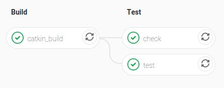

# Scale your Workflow

---

## Overview

* Project Management
* Development
* Documentation

---

## Project Management

Integrated in [GitLab](https://gitlab.com)|[GitHub](https://github.com)|[Bitbucket](https://bitbucket.org)|...

* Issue Trackers
* Milestones
* Boards
* ...

---

### Issue Trackers

* Collect ideas
* Document and discuss your decisions/progress
  * For/with others
  * For/with your future self

---


---

### Team Discussions

* Early feedback
* Constantly explain/justify/rethink your ideas

**Fail Often, Fail Fast, Fail Early**

---

## Development

---

### Implementation

* Common rules you should always follow
  * SOLID Guidelines
  * DRY (Don't repeat yourself)
* Design Patterns
  * Existing solutions for common design problems
  * Don't reinvent the wheel

---

### Testing

* Unit Tests
  * Test individual components
* Integration Tests
  * Test interaction of larger parts
* System Tests
  * Test the entire system

---

### Checks

* Consistency is key
* Automate whenever possible
* Code Format
  * Consistent code layout
  * Available for almost every language
* Linters
  * Avoid common errors

---

#### C++

* Clang-Format
* CMake-Format
* Clang-Tidy
* CppCheck
* CppLint

---

#### Python

* black
* yapf
* pylint
* flake8

---

#### Sample

```python
for t, m, ms in bag.read_messages():
    # do something
```

```shell
C0103: Variable name "t" doesn't conform to snake_case
naming style (invalid-name)

W0612: Unused variable 't' (unused-variable)
```

---

### Tools

Know your tools

* IDE for the heavy development
* Editor as your swiss army knife
* Shortcuts

---

### Version Control

* [Git](https://git-scm.com/) as most common tool
* [Git Feature Branch Workflow](https://www.atlassian.com/git/tutorials/comparing-workflows/feature-branch-workflow)
* Code Review
  * Knowledge transfer in both directions

---

### Continuous Integration

* Automatically run in a configured environment
* Requires scripted/containerized environment setup
* Avoid *"Works on my machine"*

---

#### CI Failure


---

#### CI Pass



---

## Documentation

* Summarize the latest status
* Requires active maintenance

---

# Questions?
