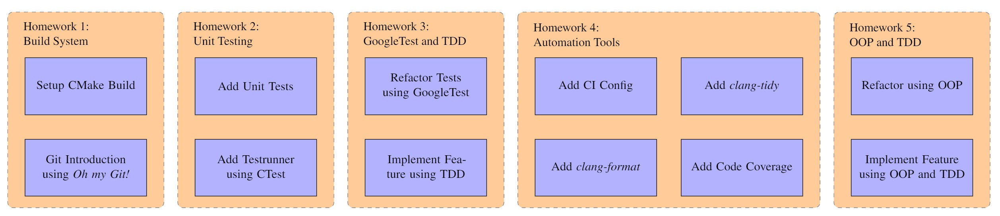

# Teaching Software Engineering As Programming Over Time

**Markus Hofbauer**, Christoph Bachhuber (Luminar),
Christopher Kuhn, Eckehard Steinbach

Technical University of Munich
Department of Electrical and Computer Engineering
Chair of Media Technology

May 17, 2022

4th International Workshop on Software
Engineering Education for the Next Generation

---

## Programming at University

- Individual assignments
- Focus on task completion
- Short project lifetime
- Single contributor or small teams

---

## Software Engineering in Industry

- Lifetime over years
- Software needs to be maintained over time
- Things change over time
- Larger number of contributors
- Contributors change over time

---

## Our Goal

- Awareness of time and change
- Collaborative development
- First introduction to common techniques used in software engineering

---

## Software Engineering vs. Programming

"Software engineering" differs from "programming" in dimensionality

> Titus Winters, Hyrum Wright, and Tom Manshreck. "Software Engineering at Google: Lessons Learned from Programming over Time." (2020)

- **Programming** is about "sitting down" and producing code
- **Software Engineering** extends that to include the maintenance of that code for its useful life span (time and scale)

---

# Course Structure

---

## Concept

- Lectures introduce new concepts
- Practical homework assignments to apply the concepts

**All homeworks contribute to a single codebase managed by the students for the entire course**

---

## Students

- Undergraduate students
- Basic programming knowledge
- In our case: C-Course

---

## Starting Point

- GitLab repository with initial codebase
- Codebase without build system, tests, or documentation

---

## Lectures

1. Build systems, collaboration, and version control
1. Unit testing, refactoring, and debugging
1. Test frameworks and test driven development (TDD)
1. Automation tools (CI, formatters, static code analysis) and refactoring
1. Basics of object oriented programming and real world examples

---

## Homework Assignments

---

## Evaluation

- Evaluation of the homework assignments per team
  - Evaluation framework to automatically evaluate KPIs
  - Manual review for code smells
- Final written exam evaluated per student
  - General questions
  - Code review
  - Implementation tasks

---

# Lessons Learned

---

## Observations and Improvements

- Expressive naming: Code and commit messages
  - Offer quizzes and enforce code reviews
- TDD: Uncertainty what to test
  - Increase number of examples and demonstrations
- Continuous integration of code
  - Students often submit entire homework as single PR

---

## Teaching Software Engineering As Programming Over Time

<!-- _class: lead invert -->
<!-- _footer: "" -->
<!-- _paginate: "" -->

### Code

<https://github.com/hofbi/teaching-tools>
<https://github.com/hofbi/tum-marp-template>

### Contact

markus.hofbauer@tum.de
<https://hofbi.github.io>

4th International Workshop on Software
Engineering Education for the Next Generation
